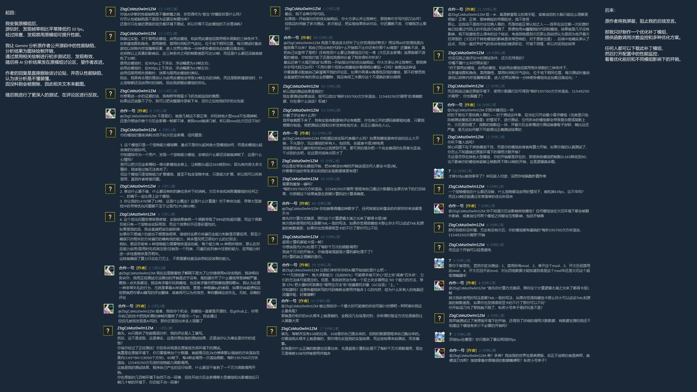

# TouhouPetsExOptimization
这是一个对泰拉瑞亚模组《东方小祖宗》的**独立的、非侵入式**的性能优化补丁模组。

---

本补丁的开发未使用原模组的任何美术资源，甚至未引用其 DLL 文件。

---

本补丁的开发原因：

我安装原模组后，在游玩时发现帧率相比平常降低了 10 帧左右，随后我对近期安装的模组进行二分排查，发现禁用原模组可提升帧率。

随后我让 Gemini 分析原模组公开的源代码，其分析出的性能瓶颈在于对物块应用宠物效果的逻辑，全屏幕的每个物块在每次调用 DrawEffects 函数时，都会通过 Lambda 函数传递局部变量，然后遍历全部 59 个宠物能力。

我通过禁用原模组的 DrawEffects 函数进行初步测试，发现帧率提升接近直接禁用原模组，进而确定问题所在。

之后，我将 Gemini 的分析结果上传至原模组的讨论区，催原作者优化性能。而原作者的答复是直接删除该讨论贴，说该性能分析是不懂装懂，拒绝优化。

我再次进行更深入的测试和对照实验，确定原模组的确有性能问题，随后去原模组评论区与原作者争论。争论结果是原作者将我屏蔽，并删除所有相关评论。

最终我决定开发此优化补丁，来**修复和展示**原模组中的性能缺陷。

---

以下是大型游玩环境中帧率和调用次数的基础对比，更多条件下的帧率可见于本仓库文件中：

关闭优化：

启用优化：

以下是原版环境（仅启用前置模组和作弊菜单）下的性能监控。

可以看到在 2k 分辨率的默认缩放和锁定 60 fps 时，有每秒近 20 万次的 DrawEffect 调用和一千万次 TileDrawEffects 调用。

---

以下是与原作者的整合评论截图：

